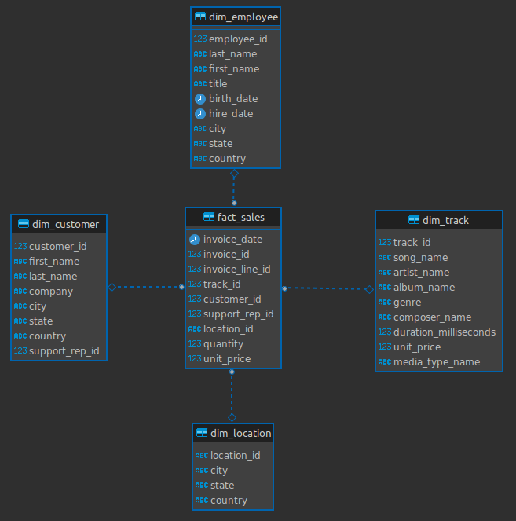

# data-warehouse-modeling-with-dbt-pybaq

En este repositorio se almacena el código fuente para la charla de Python Barranquilla (PYBAQ) llamada
[Modelado de Data Warehouses con DBT.](https://www.youtube.com/watch?v=CPxE3aC9xdQ)

DBT es un Framework de Python que se utiliza para el modelado de Data Warehouses y ayuda a simplificar las tareas de creación de tablas y vistas, así como la inserción de los datos en las mismas. Para mayor información dar clic [aquí.](https://docs.getdbt.com/docs/introduction)

# Caso de Ejemplo

El caso de ejemplo presentado es crear un Data Warehouse a partir la base de datos Chinnok. Que es una base de datos de una tienda digital de productos audiovisuales.


El objetivo es crear el Data Warehouse de Chinook a partir del modelo operacional.



# DEMO

Para probar este código. Siga la siguientes instrucciones:

1. Descargue el repositorio.
2. Ejecute Docker Compose para inicializar la base de datos.
```shell
docker-compose up -d
```

3. instale DBT utilizando el siguiente comando:
```shell
pip install dbt-postgres
```

# Colaboración
Si encuentras algún BUG o consideras que puedes ayudar a mejorar el código, sientete libre de abrir un Pull Request con tus sugerencias de cambio.


